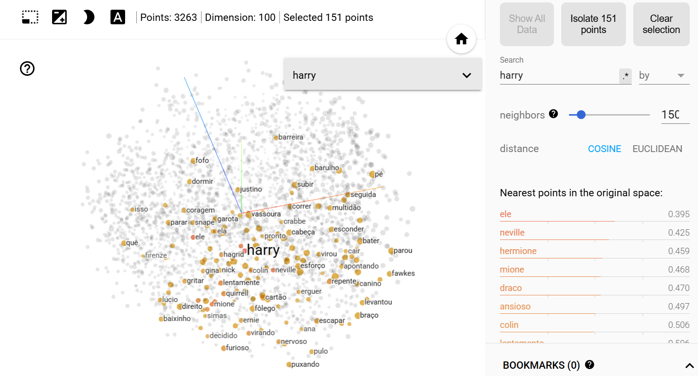
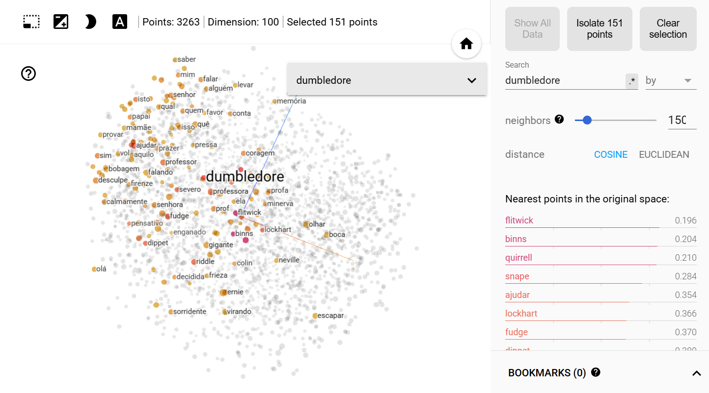
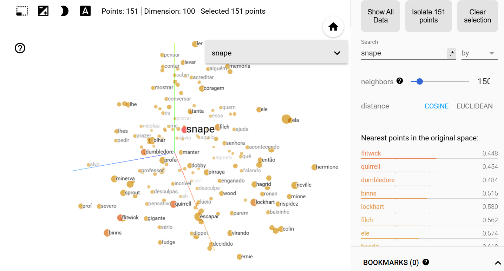
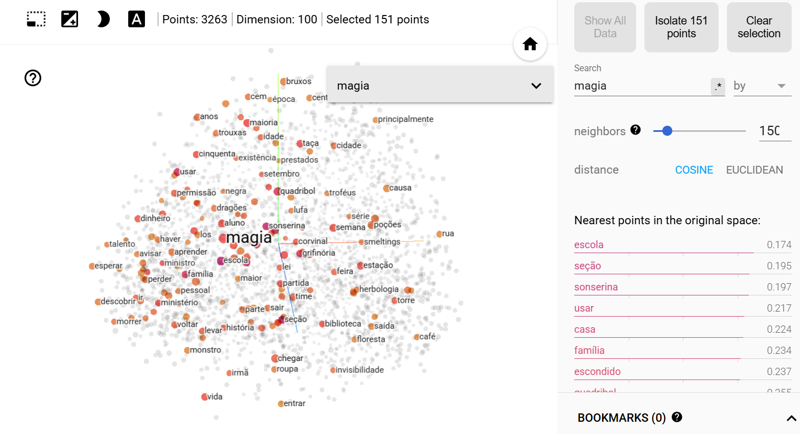

#  Word2Vec

Este TPC consistiu na criação de um modelo Word2Vec utilizando a biblioteca **gensim**, com base em dois livros de Harry Potter:  
- *Harry Potter e a Pedra Filosofal*  
- *Harry Potter e a Câmara dos Segredos*

O objetivo é criar *embeddings* de palavras para analisar relações semânticas entre palavras, como nomes de personagens, objetos e conceitos, no contexto destes textos.


### Preparação dos Dados
- Foram lidos dois ficheiros de texto (`Harry_Potter_e_A_Pedra_Filosofal.txt` e `Harry_Potter_Camara_Secreta-br.txt`).
- Cada linha foi tokenizada em palavras minúsculas com `gensim.utils.tokenize`.
- Os tokens foram agrupados numa lista de frases (`sents`) para treinar o modelo.

### Treino do Modelo
- O modelo **Word2Vec** foi treinado com:
  - `vector_size=100` (dimensão dos embeddings)
  - `epochs=20` (iterações de treino)


# Resultados
## 1. Palavras Mais Frequentes: 
O método `model.wv.index_to_key` permite aceder às palavras mais frequentes que foram aprendidas durante o treino do modelo Word2Vec. A instrução seguinte imprime as 100 palavras com maior frequência no vocabulário:

**Input:**
```python
print(list(model.wv.index_to_key[:100]))
```

**Output**
```python

['de', 'que', 'a', 'o', 'e', 'harry', 'se', 'não', 'para', 'um', 'uma', 'os', 'com', 'do', 'em', 'ele', 'da', 'disse', 'é', 'no', 'rony', 'na', 'você', 'mas', 'por', 'as', 'mais', 'estava', 'como', 'quando', 'eu', 'era', 'à', 'ao', 'muito', 'foi', 'hagrid', 'está', 'dos', 'coisa', 'me', 'hermione', 'sua', 'seu', 'eles', 'ela', 'bem', 'das', 'cabeça', 'olhos', 'isso', 'ter', 'até', 'tinha', 'dumbledore', 'vez', 'perguntou', 'sem', 'vai', 'então', 'ser', 'lhe', 'só', 'porta', 'lo', 'agora', 'snape', 'já', 'parecia', 'weasley', 'pelo', 'dois', 'fazer', 'potter', 'vocês', 'nada', 'voz', 'lockhart', 'depois', 'dizer', 'todos', 'vamos', 'nunca', 'havia', 'quem', 'alguma', 'aqui', 'seus', 'tão', 'sr', 'nem', 'pela', 'dele', 'nos', 'draco', 'fora', 'lado', 'quase', 'estavam', 'sabe']
```

## 2. Similaridade de palavras:

A função `model.wv.similarity(palavra1, palavra2)` calcula o grau de similaridade entre duas palavras com base nos seus vetores do modelo. Abaixo, apresenta-se um exemplo de utilização e o respetivo resultado:

**Input:**
```python
model.wv.similarity('harry', 'gina')
```

**Output:**
```python
0.47156575
```

Os valores de similaridade para outros pares de palavras testados encontram-se resumidos na tabela seguinte:

| Par de Palavras       | Similaridade |
|-----------------------|--------------|
| `rony` e `hermione`   | 0.6555       |
| `harry` e `hagrid`    | 0.5012       |
| `harry` e `dumbledore`| 0.3629       |
| `harry` e `dobby`     | 0.4403       |

## 3. Palavras Mais Semelhantes

Utilizando o método `model.wv.most_similar()`, é possível identificar as palavras que o modelo Word2Vec considera semanticamente mais próximas de uma palavra dada — quanto maior o valor, mais semelhantes são os contextos em que as palavras aparecem.

### Exemplo 1:
**Input:**
```python
model.wv.most_similar('harry')
```

**Output:**
```python
[('neville', 0.6036941409111023),
 ('mione', 0.6022164225578308),
 ('draco', 0.5958917737007141),
 ('colin', 0.5761808753013611),
 ('ele', 0.5587642192840576),
 ('quirrell', 0.5433545708656311),
 ('hermione', 0.5266537070274353),
 ('rony', 0.5179792046546936),
 ('furioso', 0.5165421366691589),
 ('lentamente', 0.5137933492660522)]
```

Observa-se, por exemplo, que palavras como neville, mione, draco e rony surgem como próximas de harry, refletindo a proximidade desses personagens ao protagonista na narrativa. 

### Exemplo 2:
**Input:**
```python
model.wv.most_similar('dumbledore')
```

**Output:**
```python
[('flitwick', 0.8086791634559631),
 ('binns', 0.798825740814209),
 ('quirrell', 0.7714910507202148),
 ('snape', 0.6890683770179749),
 ('lockhart', 0.6211598515510559),
 ('fudge', 0.6054230332374573),
 ('dippet', 0.5813915133476257),
 ('hagrid', 0.5702838897705078),
 ('professor', 0.5701861381530762),
 ('ajudar', 0.5664731860160828)]
```

De forma semelhante, nomes como "flitwick", "binns", "snape" e "hagrid" aparecem como semanticamente semelhantes a dumbledore, todos eles professores ou figuras de autoridade em Hogwarts.

### Exemplo 3:
**Input:**
```python
model.wv.most_similar('sonserina')
```

**Output:**
```python
[('grifinória', 0.8385443687438965),
 ('taça', 0.7940594553947449),
 ('magia', 0.7734622359275818),
 ('escola', 0.7478455901145935),
 ('torre', 0.7449879050254822),
 ('reservada', 0.7406072616577148),
 ('corvinal', 0.7335519194602966),
 ('seção', 0.7306842803955078),
 ('existência', 0.7255863547325134),
 ('biblioteca', 0.7218431234359741)]
```


## 4. Analogias

O método `model.wv.most_similar(positive=[...], negative=[...])` permite realizar operações semânticas entre palavras, explorando relações análogas no espaço vetorial. A ideia é que, ao combinarmos palavras com significados semelhantes e subtrairmos outras, podemos encontrar conceitos que completam analogias.

### Exemplo 1:
**Input:**
```python
model.wv.most_similar(positive=['grifinória', 'malfoy'], negative=['harry'])
```

**Output:**
```python
[('weasley', 0.5967212915420532),
 ('lufa', 0.5891095399856567),
 ('pontos', 0.5844677686691284),
 ('existência', 0.5583809614181519),
 ('corvinal', 0.5468419790267944),
 ('sonserina', 0.5461311340332031),
 ('mason', 0.5448892116546631),
 ('capitão', 0.5386407971382141),
 ('figg', 0.5315778255462646),
 ('troféus', 0.5285083055496216)]
```

Esta procura tenta identificar quem, na perspetiva de Malfoy, teria um papel semelhante ao de Harry em "Grifinória". Como Harry é um dos principais representantes da "Grifinória" e Malfoy é associado à "Sonserina", o modelo procura uma figura equivalente a Harry, mas do lado do rival.
- **weasley, lufa, corvinal, sonserina**: referem-se a outras casas ou membros de casas, indicando a relação entre personagens e equipas.
- **pontos, capitão, troféus**: referem-se a contextos competitivos entre as casas de Hogwarts.
- **existência, figg, mason**: personagens ou termos que podem representar ligações indiretas ou contrastantes.


### Exemplo 2:

**Input:**
```python
model.wv.most_similar(positive=['dumbledore', 'escola'], negative=['voldemort'])
```

**Output:**
```python
[('floresta', 0.6055327653884888),
 ('boca', 0.5761124491691589),
 ('classe', 0.5683574080467224),
 ('grifinória', 0.5681403279304504),
 ('biblioteca', 0.5538199543952942),
 ('garota', 0.5427629351615906),
 ('ala', 0.5415136218070984),
 ('festa', 0.5411380529403687),
 ('capa', 0.5399580597877502),
 ('lista', 0.5356548428535461)]
```

Esta analogia procura captar o universo positivo e académico de Dumbledore e da escola, removendo a influência negativa de Voldemort. Os resultados remetem para locais, atividades e personagens ligados ao ambiente escolar e seguro.


- **floresta, biblioteca, ala, classe:** locais emblemáticos da escola de magia.

- **garota, capa, lista:** elementos do quotidiano escolar.

- **festa, grifinória**: termos ligados à vivência positiva e social em Hogwarts.


### Palavra fora do contexto

A função `doesnt_match` permite identificar que palavra não se encaixa no contexto das outras palavras, com base nos padrões que foram apreendidos pelo modelo.

### Exemplo 1:

**Input:**
```python
model.wv.doesnt_match(['harry', 'ron', 'hermione', 'voldemort'])
```

**Output:**
```python
'voldemort'
```

Neste exemplo, "voldemort" foi identificado como a palavra fora de contexto, pois, enquanto "harry", "ron" e "hermione" são as personagens principais e amigos dentro da história, "voldemort" é o antagonista, representando um contraste significativo com as outras palavras no contexto de amizade e lealdade.


### Exemplo 2:

**Input:**
```python
model.wv.doesnt_match(['mcgonagall', 'snape', 'harry', 'lupin'])
```

**Output:**
```python
'harry'
```

Neste caso, "harry" foi identificado como a palavra fora do contexto, uma vez que não é um professor de Hogwarts, ao contrário de McGonagall, Snape e Lupin, que são todos professores. Isto faz com que "harry" seja a palavra que não se encaixa no grupo.

### Exemplo 3:

**Input:**
```python
model.wv.doesnt_match(['varinha', 'vassoura', 'livro'])
```

**Output:**
```python
'livro'
```


A palavra "Livro" foi identificada como fora de contexto, já que, enquanto "varinha" e "vassoura" são objetos mágicos utilizados em Hogwarts, "livro" é um objeto mais genérico e não está diretamente associado à prática mágica, destacando-se semanticamente das outras palavras.


## Exportar e visualizar o modelo: 

Os vetores foram guardados como `model_harry.txt`, através do comando:
  
  ```bash
  model.wv.save_word2vec_format('model_harry.txt', binary = False)
  ```

  
Posteriormente, o modelo foi convertido com `gensim.scripts.word2vec2tensor` e preparado para visualização no [TensorFlow Projector](https://projector.tensorflow.org/), permitindo explorar visualmente os embeddings, através do comando:

```bash
python -m gensim.scripts.word2vec2tensor -i model_harry.txt -o model_harry
```

Com isto, foram criados dois ficheiros, o `model_harry_metadata.tsv` e o `model_harry_tensor.tsv`, que serão usados para a visualização no 
[TensorFlow Projector](https://projector.tensorflow.org/).


### Visualização no TensorFlow Projector

Após a conversão do modelo para o formato adequado, podemos explorar os embeddings gerados diretamente na plataforma TensorFlow Projector. Esta ferramenta permite visualizar a relação entre os vetores de palavras, proporcionando uma representação gráfica das similaridades e distâncias entre as palavras do modelo.

As imagens a seguir ilustram algumas das visualizações geradas pelo TensorFlow Projector, mostrando como os embeddings do modelo de "Harry Potter" foram organizados.








